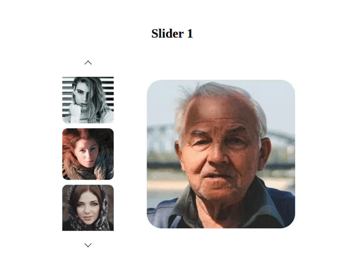
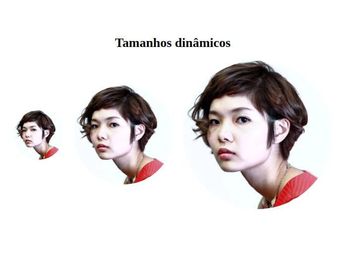
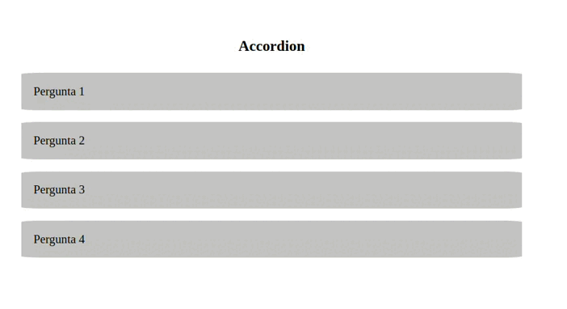
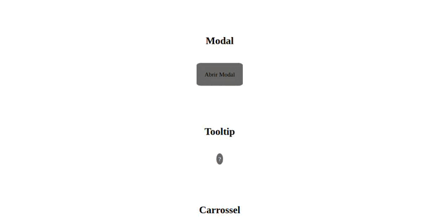
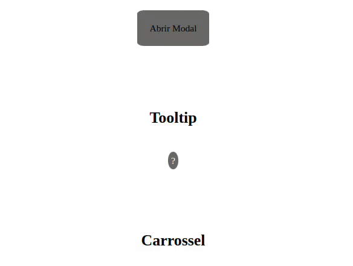
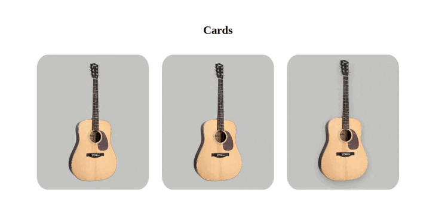

<div align="center">
    
    
    
    
</div>

# :question: Components SASS

Projeto em desenvolvimento com o objetivo de criar componentes para o frontend, todos construídos do zero.
O desenvolvimento envolve o uso mínimo de HTML, um pouco de JavaScript, e a maior parte do estilo é implementada com SASS.

### :computer: Tecnologias

Este projeto foi desenvolvido com as seguintes tecnologias:

-  [HTML](https://developer.mozilla.org/pt-BR/docs/Web/HTML)
-  [JavaScript](https://developer.mozilla.org/pt-BR/docs/Web/JavaScript)
-  [SASS](https://sass-lang.com/)

### :arrow_forward: Em Execução:








### :information_source: Como usar:

Para clonar e executar esta aplicação, você precisará do Git instalado em seu computador. Na linha de comando:

```bash
# Clonar este repositório
$ git clone https://github.com/DiegoTeixeira7/componentsSASS.git

# Vá para o repositório
$ cd componentsSASS

# Execute no VS Code
- Instale as extensões Live Sass Compiler e Live Server e execute
```
